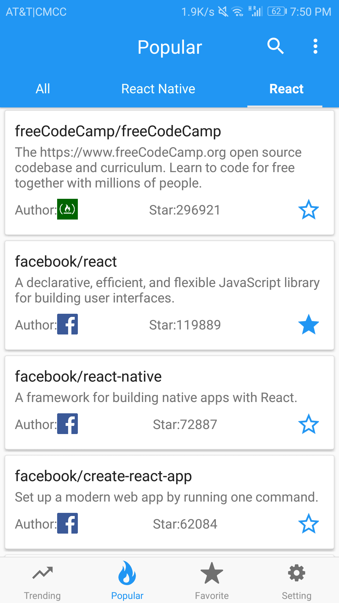
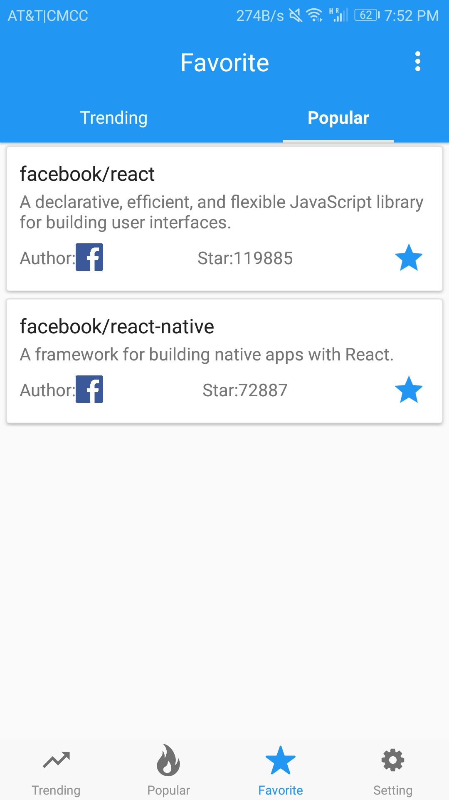
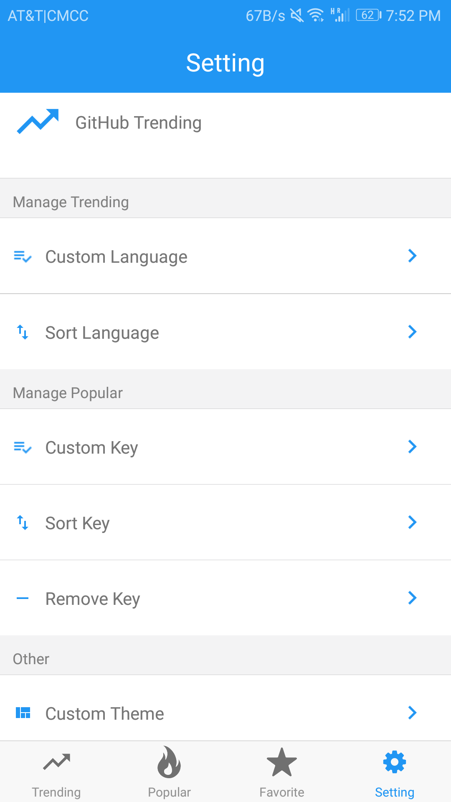

## GitHub Trending
Android and iOS client for GitHub popular and trending projects based on React Native.

### Tech Stack
ES6 + React Native + Flexbox + AsyncStorage + Fetch

### Features
1. Browse GitHub trending and popular projects
2. Offline cache
3. Add projects to favorites
4. Search GitHub projects at Popular module
5. Customize and sort languages at Trending module
6. Support 50+ languages
7. Customize and sort keywords at Popular module
8. Customize theme

### Demo

